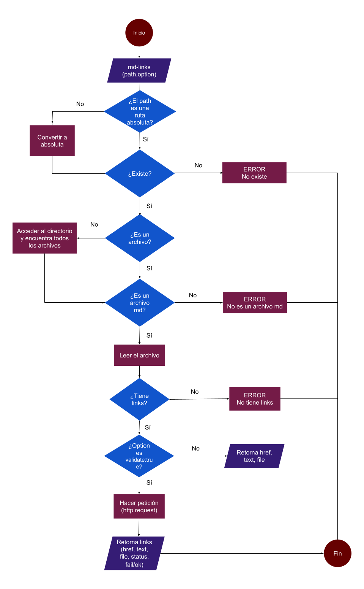
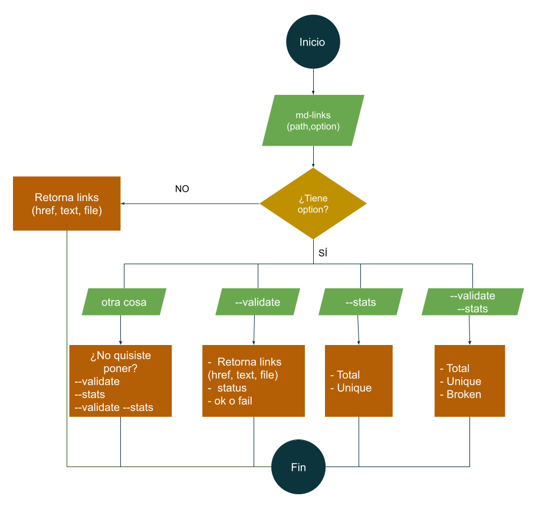
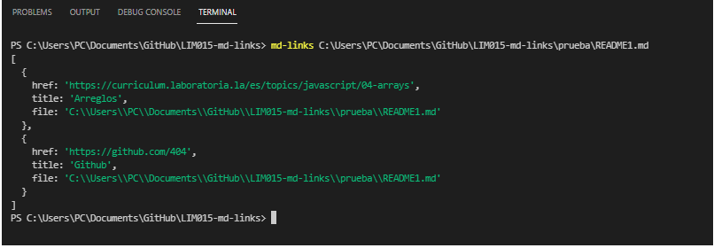
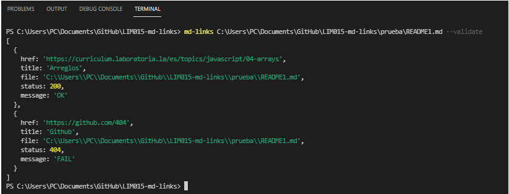
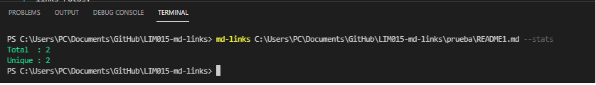
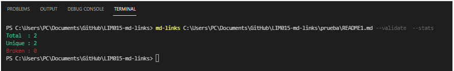
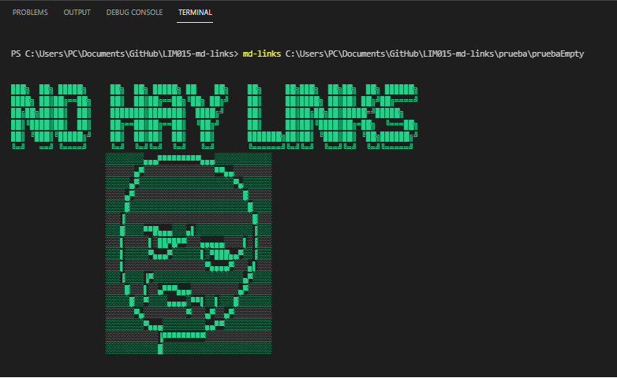
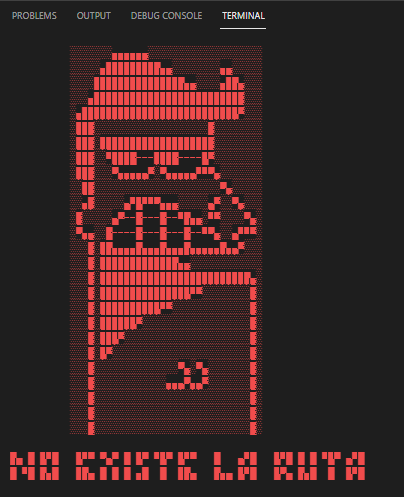
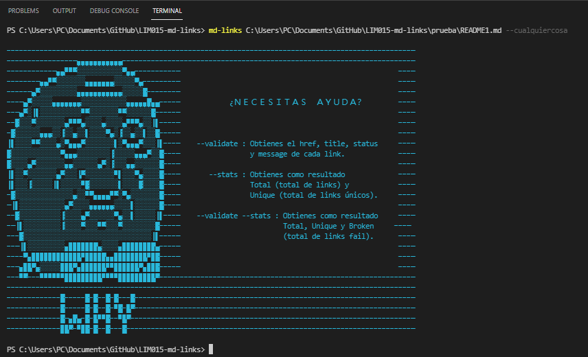

# Mdlinks-meme (ง ͠° ͟ل͜ ͡°)ง 

## 1. Md-links 💻

Es una librería que verifica que todos los links en un archivo estén ok. Para esto la librería accede a distintos archivos o directorios para obtener sólo los que estén en formato `Markdown`. También reporta algunas estadísticas como la cantidad total de links, la cantidad de links únicos y la cantidad de links rotos.

## 2. Diagramas de flujo 📌

Para poder implementar esta librería, se realizaron 2 diagramas de flujo.



### CLI (Command Line Interface - Interfaz de Línea de Comando)



## 3. Modo de Uso ✒

#### Cuando sólo pones la ruta.



#### Cuando pones la ruta y --validate.



#### Cuando pones la ruta y --stats.



#### Cuando pones la ruta y --validate --stats.



#### Cuando la ruta no tiene links.



#### Cuando pones mal la ruta.



#### Cuando pones bien la ruta pero mal las opciones.



### 4. Instalación 📦

```js
npm install mdlinks-meme.
```